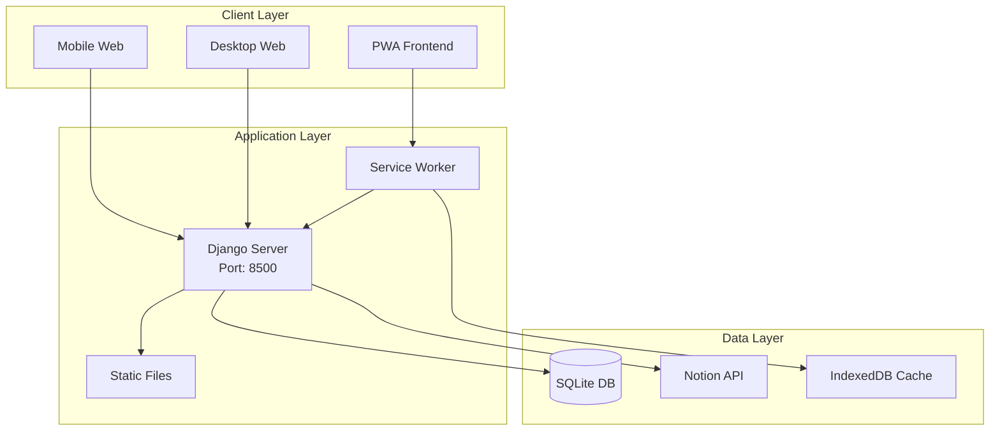
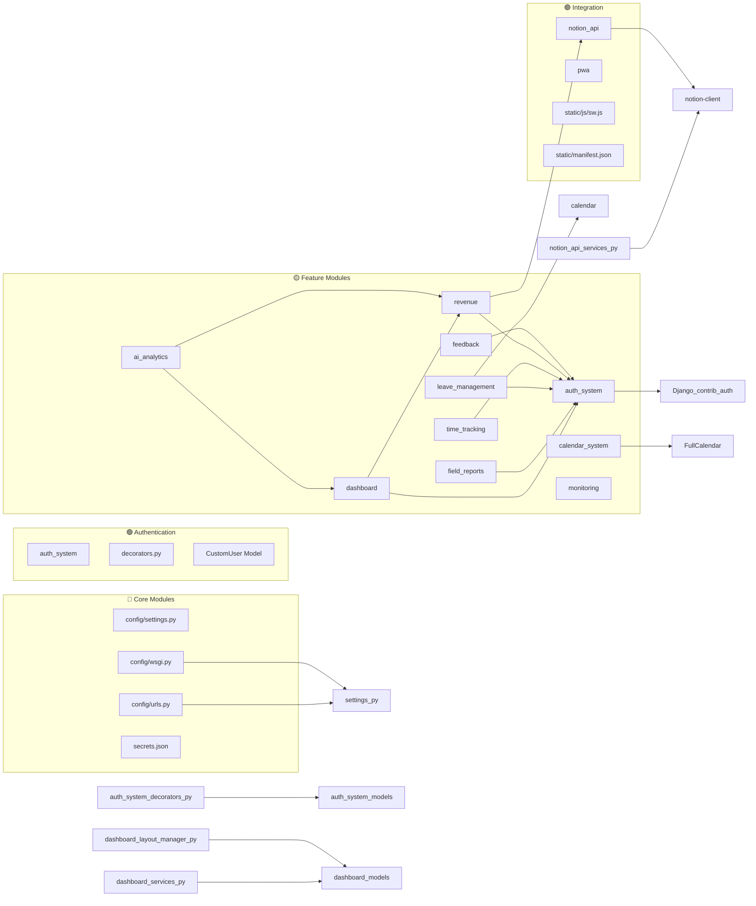
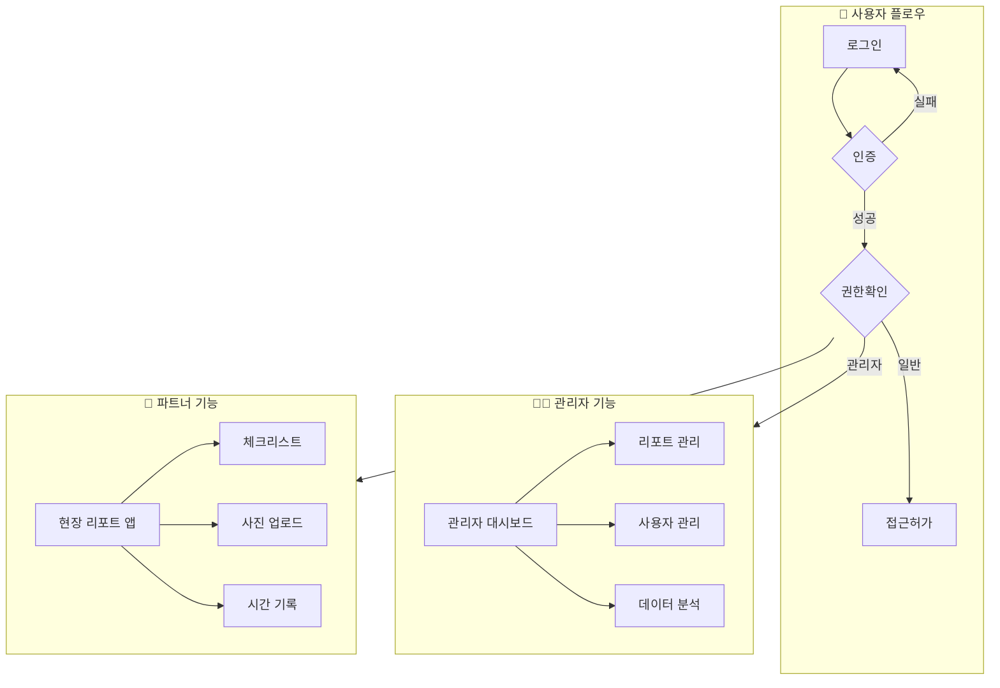
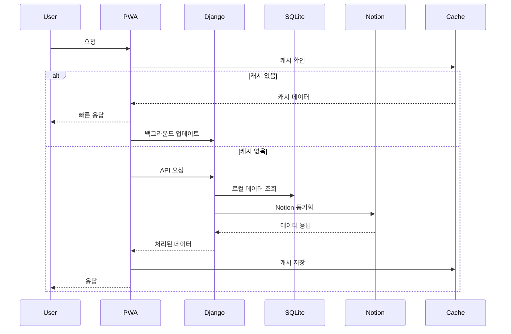
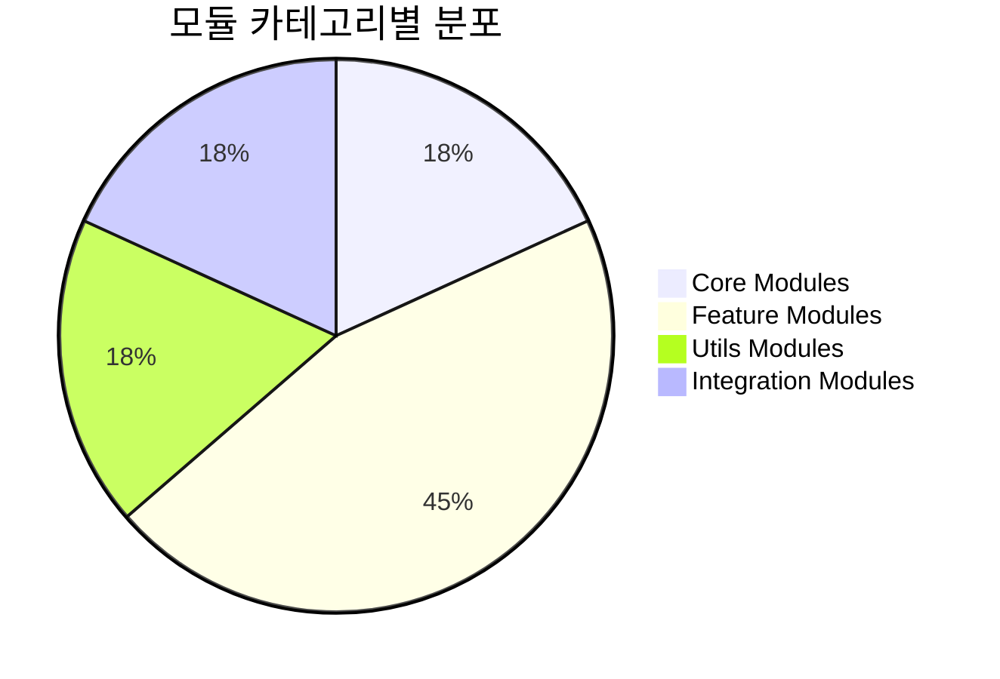
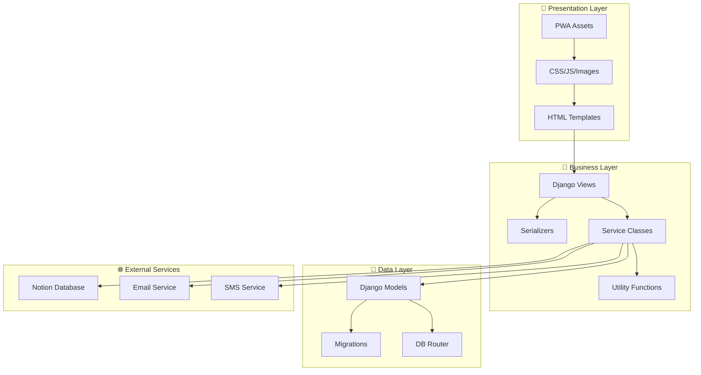
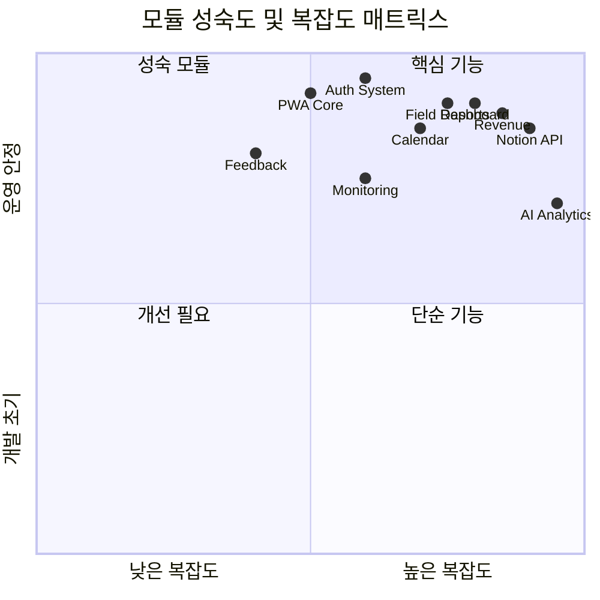
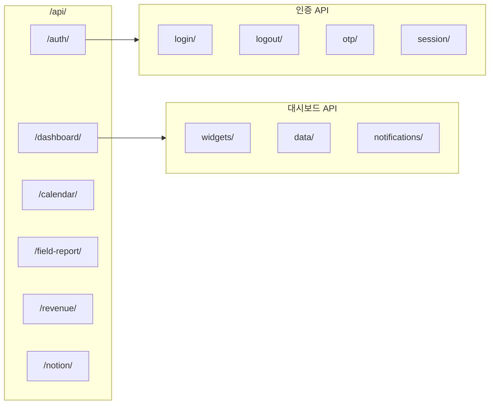

# OneSquare 시스템 아키텍처

> 시스템 전체 아키텍처와 모듈 간 의존성을 시각화한 문서

---

## 📊 전체 시스템 아키텍처

## 🔧 모듈 의존성 다이어그램

## 🎯 기능별 모듈 관계도

## 🔄 데이터 플로우

## 📦 모듈 카테고리 분포

## 🏗️ 시스템 레이어 구조

## 📈 모듈 성숙도 매트릭스

## 🔗 주요 API 엔드포인트 구조

---

## 📝 다이어그램 업데이트 가이드

1. **새 모듈 추가 시**
   - 해당 카테고리의 subgraph에 모듈 추가
   - 의존성 화살표 연결
   - 색상 코드 준수 (Core: 🔵, Auth: 🟢, Features: 🟡, Integration: 🟣)

2. **의존성 변경 시**
   - 화살표 방향 확인 (의존하는 쪽 → 의존받는 쪽)
   - 순환 의존성 방지

3. **자동 업데이트 스크립트**
   - `update-architecture.py` 실행
   - MODULE_TRACKER.md 기반 자동 생성

---

*마지막 업데이트: 2025-09-08 00:30:33*
*자동 생성 스크립트: `/scripts/update-architecture.py`*